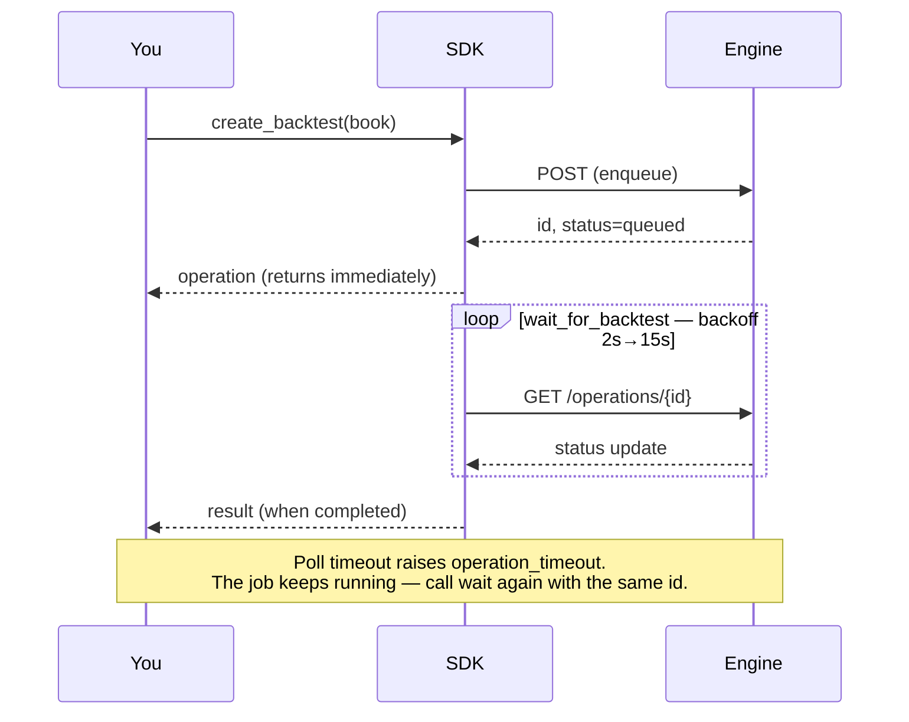
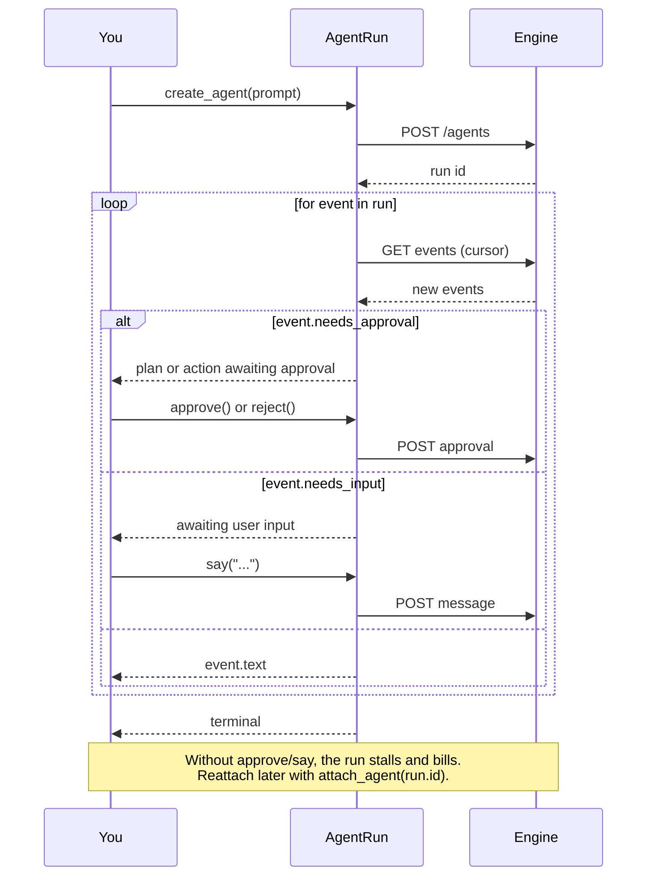
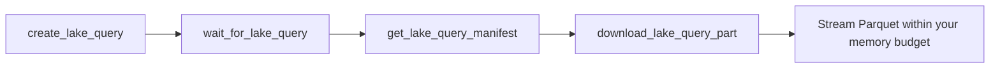

<div align="center">


# NexusTrade Python SDK

**Author trading strategies in typed Python. Backtest them on the engine that runs them live.**

[](https://pypi.org/project/nexustrade/)
[](https://pypi.org/project/nexustrade/)
[](LICENSE)
[](https://peps.python.org/pep-0561/)

[Quickstart](#quickstart) · [Authoring](#authoring-strategies) · [Polling](#jobs-run-on-the-engine--you-poll) · [Agents](#agent-runs) · [Lake SQL](#lake-sql) · [Auth](#authentication) · [Errors](#errors)

</div>

---

```bash
pip install nexustrade
```

The base install is **stdlib-only** — no third-party dependencies, importable anywhere.

```bash
pip install 'nexustrade[lake]'    # DuckDB/pandas analysis of lake results
pip install 'nexustrade[stats]'   # spec curves, Newey-West, bootstrap
```

## Quickstart

```python
from nexustrade import NexusTradeClient, always, backtest, buy, portfolio, stock_asset, strategy

nt = NexusTradeClient(api_key="sk-...", base_url="https://nexustrade.io/api/v1")

book = portfolio("Example", [
    strategy("Buy SPY", always(), buy(stock_asset("SPY"), 100)),
])

operation = nt.create_backtest(
    backtest(book, start_date="2024-01-01", end_date="2024-12-31"),
    idempotency_key="example-v1",
)
result = nt.wait_for_backtest(operation["id"])
print(result["result"])
```

## Authoring strategies

Every builder is generated from the same indicator specification the NexusTrade
engine runs, so a book is **valid by construction** rather than by convention.
Indicators compose with ordinary Python operators.

```python
import nexustrade as nt

book = nt.portfolio("Momentum", [
    nt.strategy(
        "Rotate into strength",
        nt.always(),
        nt.dynamic_rebalance(
            universe_config=nt.universe("SP500"),
            pipeline=[
                nt.filter(nt.Price(nt.CANDIDATE) > nt.SMA(nt.CANDIDATE, 200)),
                nt.select_top(nt.RSI(nt.CANDIDATE, 14), 10),
            ],
            weight_indicator=nt.RSI(nt.CANDIDATE, 14),
            limit=10,
            deployment_percent=80,
        ),
    ),
], initial_value=100_000)
```

<details>
<summary><b>What you can build</b> — 170+ generated builders</summary>

| Group | Examples |
| --- | --- |
| **Price & volume** | `Price` `OpeningPrice` `HighOfDay` `VWAP` `Volume` `GapPercentage` |
| **Technicals** | `SMA` `EMA` `RSI` `BollingerBand` `AverageTrueRange` `CrossAbove` |
| **Position state** | `PositionValue` `PositionPercentChange` `PositionMaxDrawdown` |
| **Portfolio state** | `PortfolioValue` `BuyingPower` `MaxDrawdown` `InitialValue` |
| **Fundamentals** | `Fundamental` `Economic` `DaysUntilEarnings` `IsIndexMember` `IsIndustry` |
| **Options** | `OptionDaysToExpiration` `OptionCollateral` `OptionUnrealizedPnL` `open_option` `close_option` |
| **Actions** | `buy` `sell` `alert` `dynamic_rebalance` `rebalance_option` |
| **Selection** | `filter` `select_top` `select_percentile` `universe` |
| **Logic** | `always` `at_least` `at_most` `exactly` `fewer_than` `multi` |

Full list: `python -c "import nexustrade; print(nexustrade.__all__)"`

</details>

## Jobs run on the engine — you poll

`create_*` enqueues work and returns immediately. It does **not** block until
results exist. There are no webhooks today.



Every job kind reports the same envelope, so one poller serves all of them:

```python
{
  "id": "op_...",
  "kind": "backtest",          # backtest | optimization | walk_forward
  "status": "queued",          # queued | running | completed | failed | cancelled
  "result": {...},             # present only once terminal
  "error": {"code": ..., "message": ..., "retryable": ...},
}
```

```python
finished = nt.wait_for_backtest(operation["id"])   # blocks on deterministic backoff
```

| Option | Default | Meaning |
| --- | --- | --- |
| `timeout_seconds` | `900` | Give up waiting (the job keeps running) |
| `poll_interval_seconds` | `2` | First interval; backs off 1.5× |
| `max_poll_interval_seconds` | `15` | Interval ceiling |
| `raise_on_failure` | `True` | Raise on `failed`/`cancelled` instead of returning |

A timeout raises `operation_timeout` and does **not** cancel the job — call the
waiter again with the same id rather than resubmitting.

**Batches.** `create_backtests` submits many in one request and returns one
operation each; `wait_for_backtests(operations)` waits on all of them. Prefer it
over a loop: one request, one idempotency key, one rate-limit slot.

**Optimization and walk-forward** follow the identical shape:

```python
study = nt.create_walk_forward(
    nt.walk_forward(book, global_start_date="2022-01-01",
                    global_end_date="2024-12-31", fold_count=4),
    idempotency_key="wf-v1",
)
nt.wait_for_walk_forward(study["id"])
```

## Agent runs

Every other job is fire-and-poll. **Agents are not** — three states
(`pending_plan_approval`, `pending_action_approval`, `awaiting_user_input`)
cannot advance without you. Iterate the run and answer when it blocks:



```python
run = nt.create_agent("Find momentum names in the S&P 500",
                      idempotency_key="momentum-scan-v1")
for event in run:
    print(event.text)
    if event.needs_approval:
        run.approve()
    if event.needs_input:
        run.say("Focus on tech")
```

## Lake SQL

Read-only SQL over the NexusTrade market-data lake. Results are durable Parquet
parts rather than an implicitly materialized array, so a large result is
explicit rather than an out-of-memory surprise.



The `[lake]` extra wraps this pipeline in one call:

```python
import nexustrade as nt

result = nt.lake.sql(
    "SELECT ticker, date, closingPrice FROM lake.daily_ohlc WHERE ticker = ?",
    ["AAPL"],
    max_rows=10_000,
)
frame = result.to_pandas()             # memory-bounded
for batch in result.iter_batches():    # or stream within your own budget
    ...
```

Requires the `[lake]` extra. NexusTrade resolves `lake.*` server-side and picks a
compatible backing engine; your SQL does not change when it does.

## Authentication

Create a key at **[nexustrade.io/developers](https://nexustrade.io/developers)**
(Profile → API Keys). Keys start with `sk-` and are shown once.

```python
nt = NexusTradeClient(api_key="sk-...", base_url="https://nexustrade.io/api/v1")
# or set NEXUSTRADE_API_KEY / NEXUSTRADE_API_BASE_URL and:
nt = NexusTradeClient.from_environment()
```

Both variables are also read from a **`.env` file** at or above the current
directory, so a local project works with no exports and no `python-dotenv`:

```bash
# .env
NEXUSTRADE_API_KEY=sk-...
NEXUSTRADE_API_BASE_URL=https://nexustrade.io/api/v1
```

The real environment always wins — a `.env` value is used only when the variable
is absent, so a stale file can never override what you exported. Nothing is
written back to `os.environ`. Opt out with `NEXUSTRADE_DISABLE_DOTENV=1`.

| Scope | Grants |
| --- | --- |
| `read` | `get_backtest`, `get_optimization`, `get_walk_forward` |
| `write` | `create_portfolio`, `create_backtest(s)`, `create_optimization`, `create_walk_forward` |
| `lake` | Lake catalog, query lifecycle, manifests, result parts |

A key missing the scope gets `403 insufficient_scope`.

> **OAuth is not accepted here.** NexusTrade's OAuth flow serves the MCP server.
> These endpoints take `sk-` API keys only; a bearer JWT is rejected with
> `401 invalid_token`.

**Transport hardening.** HTTPS is required (except loopback). The client refuses
cross-origin redirects, so the credential cannot be replayed to another host, and
refuses to follow a redirect on any non-GET request, so a redirect can never
re-submit a paid job.

## Idempotency

Every mutation takes a key. Reusing the same key with the same request returns
the original resource instead of launching a second paid job — so a retry after
a network failure is free.

```python
nt.create_backtest(handle, idempotency_key="momentum-2024-v1")
```

## Errors

```python
from nexustrade import NexusTradeApiError

try:
    nt.create_backtest(handle, idempotency_key="run-1")
except NexusTradeApiError as error:
    if error.code == "rate_limit_exceeded":
        ...
    raise
```

| Status | Code | Meaning |
| --- | --- | --- |
| 401 | `invalid_token` | Missing, malformed, or expired key (or an OAuth JWT) |
| 403 | `insufficient_scope` | Key lacks `read`, `write`, or `lake` |
| 400 | `invalid_request`, `invalid_portfolio` | Malformed input |
| 400 | `invalid_idempotency_key` | Must match `[A-Za-z0-9._:-]{1,160}` |
| 409 | `idempotency_conflict` | Key reused with a different payload |
| 404 | `not_found`, `operation_not_found` | Unknown or not yours |
| 429 | `rate_limit_exceeded` | Back off and retry |

`status` is `0` when no HTTP status describes the failure: `transport_error`
(never reached the API), `unsafe_redirect`, or an `invalid_response` envelope
check on an otherwise-successful reply.

## Timeouts

`HttpTransport(timeout_seconds=...)` (default 30) is urllib's per-socket-operation
timeout, so a slow-but-progressing response is not cut off mid-stream. Neither it
nor the poll timeout bounds how long a *job* takes.

## Scope

Portfolio drafting, backtesting, optimization, walk-forward studies, and
read-only SQL over the market-data lake, versioned under `/api/v1/nexustrade`.
The screener and live trading remain outside this surface.

## Using this SDK with a coding agent

See **[AGENTS.md](AGENTS.md)** — the conventions, invariants, and recipes an
agent needs to write correct NexusTrade strategies on the first pass.

## License

MIT
