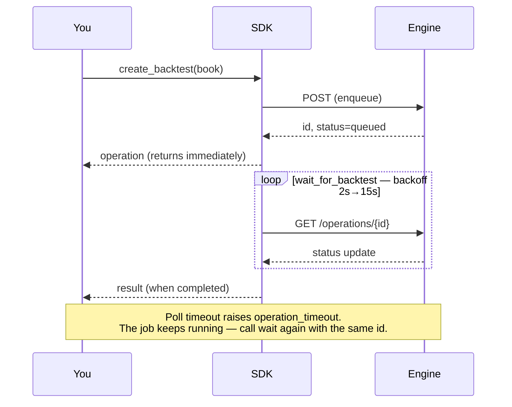
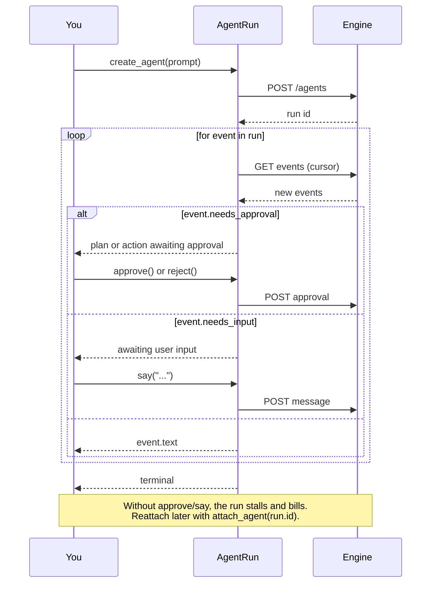
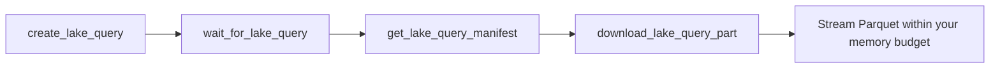

<div align="center">


# NexusTrade Python SDK

**Author trading strategies in typed Python. Backtest them on the engine that runs them live.**

[](https://pypi.org/project/nexustrade/)
[](https://pypi.org/project/nexustrade/)
[](LICENSE)
[](https://peps.python.org/pep-0561/)

[Quickstart](#quickstart) · [Authoring](#authoring-strategies) · [Polling](#jobs-run-on-the-engine--you-poll) · [Agents](#agent-runs) · [Lake SQL](#lake-sql) · [Auth](#authentication) · [Errors](#errors)

</div>

---

```bash
pip install nexustrade
```

The base install is **stdlib-only** — no third-party dependencies, importable anywhere.

```bash
pip install 'nexustrade[lake]'    # DuckDB/pandas analysis of lake results
pip install 'nexustrade[stats]'   # spec curves, Newey-West, bootstrap
```

## Quickstart

```python
from nexustrade import NexusTradeClient, always, backtest, buy, portfolio, stock_asset, strategy

client = NexusTradeClient(api_key="sk-...", base_url="https://nexustrade.io/api/v1")

book = portfolio("Example", [
    strategy("Buy SPY", always(), buy(stock_asset("SPY"), 100)),
])

operation = client.create_backtest(
    backtest(book, start_date="2024-01-01", end_date="2024-12-31"),
    idempotency_key="example-v1",
)
result = client.wait_for_backtest(operation["id"])
print(result["result"])
```

Backtest operations may include ``warnings: list[str]`` immediately after
submission and again in the terminal ``result``. Treat them as material caveats;
they do not change a successful operation into a failure.

## Authoring strategies

Every builder is generated from the same indicator specification the NexusTrade
engine runs, so a book is **valid by construction** rather than by convention.
Indicators compose with ordinary Python operators.

```python
import nexustrade as nt

book = nt.portfolio("Momentum", [
    nt.strategy(
        "Rotate into strength",
        nt.always(),
        nt.dynamic_rebalance(
            universe_config=nt.universe("SP500"),
            pipeline=[
                nt.filter(nt.Price(nt.CANDIDATE) > nt.SMA(nt.CANDIDATE, 200)),
                nt.select_top(nt.RSI(nt.CANDIDATE, 14), 10),
            ],
            weight_indicator=nt.RSI(nt.CANDIDATE, 14),
            limit=10,
            deployment_percent=80,
        ),
    ),
], initial_value=100_000)
```

<details>
<summary><b>What you can build</b> — 170+ generated builders</summary>

| Group | Examples |
| --- | --- |
| **Price & volume** | `Price` `OpeningPrice` `HighOfDay` `VWAP` `Volume` `GapPercentage` |
| **Technicals** | `SMA` `EMA` `RSI` `BollingerBand` `AverageTrueRange` `CrossAbove` |
| **Position state** | `PositionValue` `PositionPercentChange` `PositionMaxDrawdown` |
| **Portfolio state** | `PortfolioValue` `BuyingPower` `MaxDrawdown` `InitialValue` |
| **Fundamentals** | `Fundamental` `Economic` `DaysUntilEarnings` `IsIndexMember` `IsIndustry` |
| **Options** | `OptionDaysToExpiration` `OptionCollateral` `OptionUnrealizedPnL` `open_option` `close_option` |
| **Actions** | `buy` `sell` `alert` `dynamic_rebalance` `rebalance_option` |
| **Selection** | `filter` `select_top` `select_percentile` `universe` |
| **Logic** | `always` `at_least` `at_most` `exactly` `fewer_than` `multi` |

Full list: `python -c "import nexustrade; print(nexustrade.__all__)"`

</details>

## Jobs run on the engine — you poll

`create_*` enqueues work and returns immediately. It does **not** block until
results exist. There are no webhooks today.



Every job kind reports the same envelope, so one poller serves all of them:

```python
{
  "id": "op_...",
  "kind": "backtest",          # backtest | optimization | walk_forward
  "status": "queued",          # queued | running | completed | failed | cancelled
  "result": {...},             # present only once terminal
  "error": {"code": ..., "message": ..., "retryable": ...},
}
```

```python
finished = client.wait_for_backtest(operation["id"])   # blocks on deterministic backoff
```

| Option | Default | Meaning |
| --- | --- | --- |
| `timeout_seconds` | `900` | Give up waiting (the job keeps running) |
| `poll_interval_seconds` | `2` | First interval; backs off 1.5× |
| `max_poll_interval_seconds` | `15` | Interval ceiling |
| `raise_on_failure` | `True` | Raise on `failed`/`cancelled` instead of returning |

A timeout raises `operation_timeout` and does **not** cancel the job — call the
waiter again with the same id rather than resubmitting.

**Batches.** `create_backtests` submits many in one request and returns one
operation each; `wait_for_backtests(operations)` waits on all of them. Prefer it
over a loop: one request, one idempotency key, one rate-limit slot.

**Optimization and walk-forward** follow the identical shape:

```python
study = client.create_walk_forward(
    nt.walk_forward(book, global_start_date="2022-01-01",
                    global_end_date="2024-12-31", fold_count=4),
    idempotency_key="wf-v1",
)
client.wait_for_walk_forward(study["id"])
```

## Deploying a portfolio

Authoring and backtesting a book does not persist it. `save` writes it to your
account; `deploy` starts running it.

```python
book = portfolio("Momentum", [...])

book.save(idempotency_key="momentum-v1", client=client)   # persists; sets book.id
deployment = book.deploy(client=client)                   # starts paper trading
book.undeploy(client=client)                              # stops it
```

**`save` and `deploy` produce different ids, and the distinction matters.**
`save` persists a *draft* and sets `book.id` to it. `deploy` mints the real
paper portfolio and returns its own `portfolioId` — deploying creates a
portfolio rather than converting the draft into one, so the two ids coexist.
Hold on to `deployment["portfolioId"]` for anything that reads live state;
`book.id` addresses the draft.

```python
deployment["portfolioId"]      # the running portfolio
deployment["deploymentType"]   # paper, unless you deployed an existing live one
deployment["outcome"]          # created | reactivated
```

Every handle method takes `client=` as a keyword argument and falls back to
`NexusTradeClient.from_environment()` when omitted. The same operations exist on
the client itself — `client.deploy(portfolio_id)`, `client.undeploy(...)` — when
you have an id rather than a handle.

```python
client.list_portfolios(include_paper=True, include_positions=True)
client.get_portfolio(portfolio_id)
```

`list_portfolios` filters with `include_paper`, `include_live`,
`include_inactive`, `include_chat_portfolios`, `search`, `limit`, and `page`.
`include_positions` defaults off when `search` is set.

**A portfolio you create here is always paper**, and minting a *live* one still
happens in the web app. Orders and brokerage status are reachable from here;
see [Live trading](#live-trading).

**But `deploy` can start live trading.** Given the id of a portfolio that is
already deployed, it reactivates that portfolio as whatever it already is — so
`client.deploy(id)` on a paused live portfolio resumes live trading against the connected
brokerage, and `include_live=True` above will hand you such an id. Check `deployment["deploymentType"]` before
treating a deploy as simulated.

## Live trading

Live trading needs a brokerage linked to your account. Linking is an OAuth
redirect, so an API key cannot complete it — a human opens the URL.

```python
client.list_brokerages()
# [{"brokerage": "Alpaca", "connected": False,
#   "connectUrl": "https://nexustrade.io/live-trading"}, ...]

client.connect_brokerage("Alpaca")   # prints the URL, waits until connected
```

`connect_brokerage` waits by default **only when stdout is a terminal**. In CI,
cron, or `run_compute` it raises `brokerage_not_connected` immediately with the
URL in the message, rather than stalling for five minutes in front of nobody.
Pass `wait=True` or `wait=False` to force either.

A live-only listing that comes back empty raises the same error rather than an
empty list, since an empty array says nothing about why:

```python
client.list_portfolios(include_live=True, include_paper=False)
# NexusTradeApiError: brokerage_not_connected: No live portfolios, and no
# brokerage is connected. Connect one at https://nexustrade.io/live-trading
```

### Orders

```python
result = client.create_orders(
    portfolio_id,
    [{"asset": {"name": "SPY", "type": "STOCK", "symbol": "SPY"},
      "side": "BUY", "quantity": 10, "orderType": "MARKET"}],
    idempotency_key="rebalance-2024-04-01",
)

# Dollar notional (stock/crypto only — options require contract quantity):
client.create_orders(
    portfolio_id,
    [{"asset": {"name": "AAPL", "type": "STOCK", "symbol": "AAPL"},
      "side": "BUY", "amount": 500, "orderType": "MARKET"}],
    idempotency_key="buy-aapl-500",
)
```

**Paper orders are accepted immediately. Live orders are staged for approval
and are never sent to a broker by this call.**

```python
if result["requiresApproval"]:
    print("nothing has traded yet — approve at", result["approvalUrl"])
```

There is no argument, scope, or flag that submits a live order without
approval. The brokerage boundary refuses an unapproved live order regardless of
what any caller asks for, so this is a property of the system rather than a
promise made by this method. At most 50 orders per request.

## Your own data

A custom data source is a time series you own — sentiment counts, a proprietary
factor, anything the platform does not already carry. Create one, then reference
it from a strategy with `CustomIndicator`.

```python
series = client.create_custom_indicator(
    {
        "name": "WSB NVDA Mentions",
        "scope": "asset",
        "description": "Daily r/wallstreetbets mentions",
        "points": [
            {"timestamp": "2024-04-01", "value": 152, "ticker": "NVDA"},
            {"timestamp": "2024-04-02", "value": 90, "ticker": "NVDA"},
        ],
    },
    idempotency_key="wsb-mentions-v1",
)

busy = CustomIndicator(stock_asset("NVDA"), series["customIndicatorId"]) > 100
book = portfolio("Attention", [
    strategy("Buy the buzz", busy, buy(stock_asset("NVDA"), 25)),
])
```

`scope` is `"global"` (one series) or `"asset"` (one series per ticker, so every
point needs a `ticker`). It cannot be changed after creation.

**Size is not a constraint.** `points` is unlimited. A batch that fits the
request goes with it; a larger one is uploaded to storage and validated before
the call returns. Either way the returned indicator reflects what actually
landed, and an upload that fails validation raises rather than reporting
success.

**Growing a series.** Append to the same id every run:

```python
client.append_custom_indicator_points(
    series["customIndicatorId"],
    [{"timestamp": "2024-04-03", "value": 118, "ticker": "NVDA"}],
    idempotency_key="wsb-mentions-2024-04-03",
)
```

Creating a fresh series per run splits the history into fragments no strategy
can read. Re-sending an identical batch is safe — the duplicate is not written
twice.

| Call | Purpose |
| --- | --- |
| `create_custom_indicator(spec, idempotency_key=...)` | Create, optionally seeded |
| `append_custom_indicator_points(id, points, idempotency_key=...)` | Add points |
| `list_custom_indicators()` / `get_custom_indicator(id)` | Discover ids and coverage |

Points accept `timestamp`, `value`, `ticker`, `asset_type`, and `available_at`
— snake_case or camelCase, with `date`/`datetime` objects allowed. Set
`available_at` when a value became knowable later than it is dated: an earnings
figure stamped to quarter-end but published weeks after. An unrecognized field
raises rather than being silently dropped.

To hand over a file you already have on disk,
`create_custom_indicator_upload` / `complete_custom_indicator_upload` /
`wait_for_custom_indicator_upload` expose the three steps directly. CSV, JSON,
and JSONL up to 100 MB.

## Agent runs

Every other job is fire-and-poll. **Agents are not** — three states
(`pending_plan_approval`, `pending_action_approval`, `awaiting_user_input`)
cannot advance without you. Iterate the run and answer when it blocks:



```python
run = client.create_agent("Find momentum names in the S&P 500",
                      idempotency_key="momentum-scan-v1")
for event in run:
    print(event.text)
    if event.needs_approval:
        run.approve()
    if event.needs_input:
        run.say("Focus on tech")
```

## Lake SQL

Read-only SQL over the NexusTrade market-data lake. Results are durable Parquet
parts rather than an implicitly materialized array, so a large result is
explicit rather than an out-of-memory surprise.



The `[lake]` extra wraps this pipeline in one call:

```python
import nexustrade as nt

result = nt.lake.sql(
    "SELECT ticker, date, closingPrice FROM lake.daily_ohlc WHERE ticker = ?",
    ["AAPL"],
    max_rows=10_000,
)
frame = result.to_pandas()             # memory-bounded
for batch in result.iter_batches():    # or stream within your own budget
    ...
```

Requires the `[lake]` extra. NexusTrade resolves `lake.*` server-side and picks a
compatible backing engine; your SQL does not change when it does.

## Complete method reference

Every public method on `NexusTradeClient`. A test in this package fails if one
is missing here, so this list cannot drift from the code.

**Live trading and orders**

| Method | Purpose |
| --- | --- |
| `list_brokerages()` | Every connectable brokerage and whether it is linked |
| `get_brokerage(brokerage)` | Whether one brokerage is linked |
| `connect_brokerage(brokerage, wait=…)` | Print the connect URL and wait for the link |
| `create_orders(portfolio_id, orders, idempotency_key=…)` | Stage orders; live ones need approval |

**Portfolios**

| Method | Purpose |
| --- | --- |
| `create_portfolio(book, idempotency_key=…)` | Persist a portfolio definition |
| `list_portfolios(…)` | List portfolios, with filters and pagination |
| `get_portfolio(portfolio_id)` | Read one portfolio |
| `deploy(portfolio_id, frequency=…)` | Start paper trading it |
| `undeploy(portfolio_id)` | Stop it |

**Backtests**

| Method | Purpose |
| --- | --- |
| `create_backtest(handle, idempotency_key=…)` | Submit one backtest |
| `create_backtests(handles, idempotency_key=…)` | Submit many in one request |
| `get_backtest(backtest_id)` | Read the operation |
| `wait_for_backtest(backtest_id, …)` | Block until terminal |
| `wait_for_backtests(operations, …)` | Block on a whole batch |

**Optimization and walk-forward**

| Method | Purpose |
| --- | --- |
| `create_optimization(handle, idempotency_key=…)` | Submit an optimization |
| `get_optimization(optimization_id)` | Read the operation |
| `wait_for_optimization(optimization_id, …)` | Block until terminal |
| `create_walk_forward(handle, idempotency_key=…)` | Submit a walk-forward study |
| `get_walk_forward(study_id)` | Read the operation |
| `wait_for_walk_forward(study_id, …)` | Block until terminal |

**Custom data sources**

| Method | Purpose |
| --- | --- |
| `create_custom_indicator(spec, idempotency_key=…)` | Create a series, optionally seeded |
| `list_custom_indicators(include_archived=…)` | List owned series |
| `get_custom_indicator(id)` | Read one, with its point count and range |
| `append_custom_indicator_points(id, points, idempotency_key=…)` | Add points |
| `create_custom_indicator_upload(id, …)` | Open an upload slot (CSV/JSON/JSONL) |
| `complete_custom_indicator_upload(id, job_id)` | Start validating uploaded bytes |
| `get_custom_indicator_upload(id, job_id)` | Read the upload operation |
| `wait_for_custom_indicator_upload(id, job_id, …)` | Block until validated |

**Agent runs**

| Method | Purpose |
| --- | --- |
| `create_agent(prompt, idempotency_key=…)` | Start a run |
| `get_agent(agent_id)` | Read its status |
| `attach_agent(agent_id, cursor=…)` | Reattach to a run already in flight |

**Lake SQL**

| Method | Purpose |
| --- | --- |
| `create_lake_query(request, idempotency_key=…)` | Submit read-only SQL |
| `get_lake_query(query_id)` | Read the operation |
| `wait_for_lake_query(query_id, …)` | Block until terminal |
| `cancel_lake_query(query_id)` | Cancel an owned query |
| `get_lake_query_manifest(query_id)` | Schema, checksums, and part metadata |
| `download_lake_query_part(query_id, part, …)` | Download one Parquet part |
| `get_lake_catalog()` | List queryable tables |
| `describe_lake_table(table)` | Columns and types for one table |

**Client construction**

| Method | Purpose |
| --- | --- |
| `NexusTradeClient(api_key=…, base_url=…)` | Explicit credentials |
| `NexusTradeClient.from_environment()` | Read them from the environment or `.env` |

**Portfolio handle** — returned by the `portfolio(...)` builder and by
`get_portfolio` / `list_portfolios`.

| Method | Purpose |
| --- | --- |
| `save(idempotency_key=…, client=…)` | Persist it as a draft, setting `.id` |
| `backtest(start_date=…, end_date=…, idempotency_key=…, …)` | Backtest it, preferring the saved id |
| `deploy(frequency=…, client=…)` | Mint the real paper portfolio (new id) |
| `undeploy(client=…)` | Deactivate its deployment |

## Authentication

Create a key at **[nexustrade.io/developers](https://nexustrade.io/developers)**
(Profile → API Keys). Keys start with `sk-` and are shown once.

```python
client = NexusTradeClient(api_key="sk-...", base_url="https://nexustrade.io/api/v1")
# or set NEXUSTRADE_API_KEY / NEXUSTRADE_API_BASE_URL and:
client = NexusTradeClient.from_environment()
```

Both variables are also read from a **`.env` file** at or above the current
directory, so a local project works with no exports and no `python-dotenv`:

```bash
# .env
NEXUSTRADE_API_KEY=sk-...
NEXUSTRADE_API_BASE_URL=https://nexustrade.io/api/v1
```

The real environment always wins — a `.env` value is used only when the variable
is absent, so a stale file can never override what you exported. Nothing is
written back to `os.environ`. Opt out with `NEXUSTRADE_DISABLE_DOTENV=1`.

| Scope | Grants |
| --- | --- |
| `read` | `get_backtest`, `get_optimization`, `get_walk_forward` |
| `write` | `create_portfolio`, `create_backtest(s)`, `create_optimization`, `create_walk_forward` |
| `lake` | Lake catalog, query lifecycle, manifests, result parts |

A key missing the scope gets `403 insufficient_scope`.

> **OAuth is not accepted here.** NexusTrade's OAuth flow serves the MCP server.
> These endpoints take `sk-` API keys only; a bearer JWT is rejected with
> `401 invalid_token`.

**Transport hardening.** HTTPS is required (except loopback). The client refuses
cross-origin redirects, so the credential cannot be replayed to another host, and
refuses to follow a redirect on any non-GET request, so a redirect can never
re-submit a paid job.

## Idempotency

Every mutation takes a key. Reusing the same key with the same request returns
the original resource instead of launching a second paid job — so a retry after
a network failure is free.

```python
client.create_backtest(handle, idempotency_key="momentum-2024-v1")
```

## Errors

```python
from nexustrade import NexusTradeApiError

try:
    client.create_backtest(handle, idempotency_key="run-1")
except NexusTradeApiError as error:
    if error.code == "rate_limit_exceeded":
        ...
    raise
```

| Status | Code | Meaning |
| --- | --- | --- |
| 401 | `invalid_token` | Missing, malformed, or expired key (or an OAuth JWT) |
| 403 | `insufficient_scope` | Key lacks `read`, `write`, or `lake` |
| 400 | `invalid_request`, `invalid_portfolio` | Malformed input |
| 400 | `invalid_idempotency_key` | Must match `[A-Za-z0-9._:-]{1,160}` |
| 409 | `idempotency_conflict` | Key reused with a different payload |
| 409 | `idempotency_in_progress` | Same key, first call still running. Re-poll, do not resubmit |
| 404 | `not_found`, `operation_not_found` | Unknown or not yours |
| 429 | `rate_limit_exceeded` | Back off and retry |

`status` is `0` when no HTTP status describes the failure: `transport_error`
(never reached the API), `unsafe_redirect`, or an `invalid_response` envelope
check on an otherwise-successful reply.

## Timeouts

`HttpTransport(timeout_seconds=...)` (default 30) is urllib's per-socket-operation
timeout, so a slow-but-progressing response is not cut off mid-stream. Neither it
nor the poll timeout bounds how long a *job* takes.

## Scope

Portfolio drafting, backtesting, optimization, walk-forward studies, and
read-only SQL over the market-data lake, versioned under `/api/v1/nexustrade`.
The screener and creating a live deployment remain outside this surface.
Orders are reachable, but a live order is only ever staged for human approval —
never submitted. `deploy` and `undeploy` act on whatever an existing id already
is, live included.

## Using this SDK with a coding agent

See **[AGENTS.md](AGENTS.md)** — the conventions, invariants, and recipes an
agent needs to write correct NexusTrade strategies on the first pass.

## License

MIT
