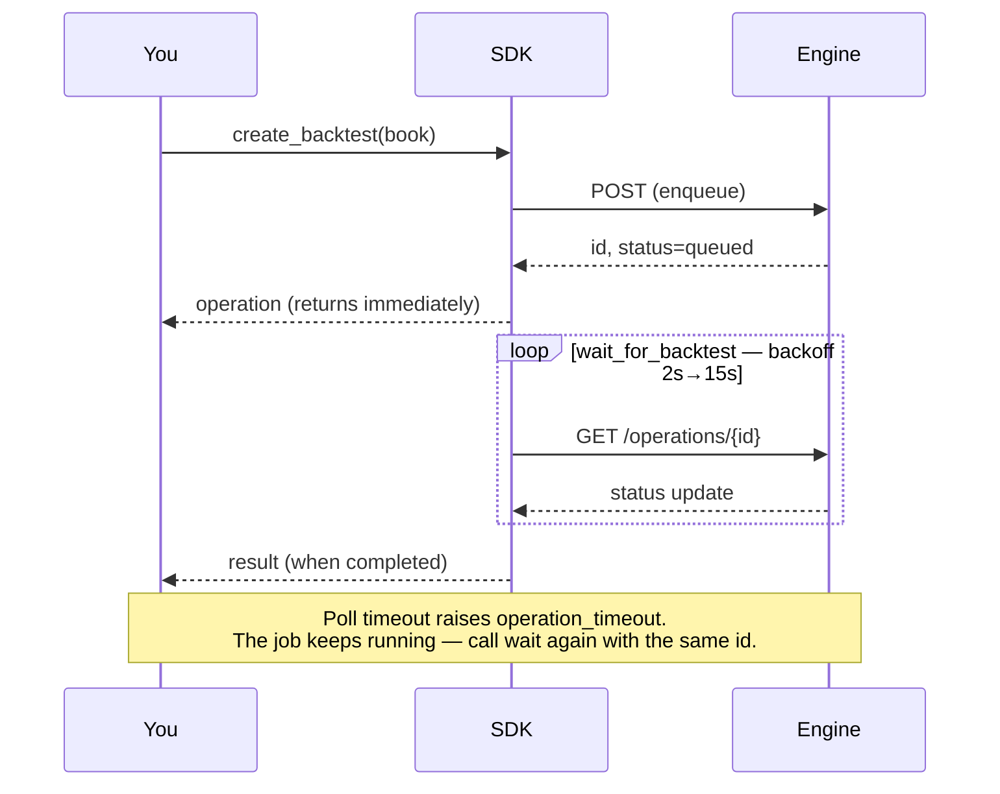
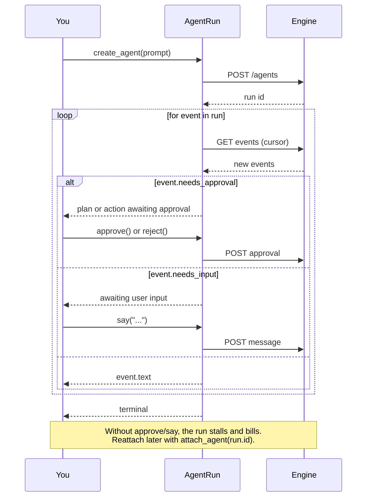
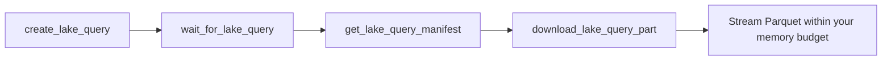

<div align="center">


# NexusTrade Python SDK

**Author trading strategies in typed Python. Backtest them on the engine that runs them live.**

[](https://pypi.org/project/nexustrade/)
[](https://pypi.org/project/nexustrade/)
[](LICENSE)
[](https://peps.python.org/pep-0561/)

[Quickstart](#quickstart) · [Authoring](#authoring-strategies) · [Polling](#jobs-run-on-the-engine--you-poll) · [Agents](#agent-runs) · [Lake SQL](#lake-sql) · [Auth](#authentication) · [Errors](#errors)

</div>

---

```bash
pip install nexustrade
```

The base install is **stdlib-only** — no third-party dependencies, importable anywhere.

```bash
pip install 'nexustrade[lake]'    # DuckDB/pandas analysis of lake results
pip install 'nexustrade[stats]'   # spec curves, Newey-West, bootstrap
pip install 'nexustrade[documents]' # PDF inspection, OCR, structured extraction
pip install 'nexustrade[compute]' # exact union used by NexusTrade compute
```

The public distribution is also the package installed in NexusTrade compute
sandboxes. Agent-facing helpers such as `nexustrade.host`,
`nexustrade.scanned_table`, `nexustrade.signal`, `nexustrade.report`, and
`nexustrade.tigris` therefore have one canonical implementation. Host-backed
operations still require the short-lived environment supplied by a compute run.

For document-derived computation, keep extraction and interpretation separate.
`extract_rows`/`extract_pdfs` preserve source observations. A corpus can recover
document-level facts and logical rows in one schema-bound pass:

```python
extracted = nt.extract_pdfs(
    documents,  # PDF bytes or successful host.fetch result objects
    document_schema={"report_date": "string", "filing_type": "string"},
    rows_schema={"asset": "string", "transaction_date": "string"},
    instructions="Return the rows requested by the task, preserving repeated rows.",
)

for source_id, result in extracted.items():
    document = result["document"]  # includes source_id
    rows = result["rows"]          # each includes source_id + _source_row_index
```

The helper sends the supplied PDF corpus in one schema-bound request by default
when it fits the gateway's combined file-input limit. It partitions only at that real
byte boundary. By default, a transport or structured-output failure remains one
failed logical request; it is not retried as smaller paid model requests. Set
`rows_retries` explicitly only to retry the same peer corpus. Set
`documents_per_request` only to intentionally partition a corpus; use `1` for
the compatibility one-document OCR path. Use
`inspect_document` only when a concrete ambiguity actually needs visual review.
For complete-corpus work, treat search results as leads rather than an inventory.
Use the publisher's listing/API/index boundary; when its metadata does not prove
document membership, extract the minimal identity fields with `document_schema`
and exclude mismatches before projecting rows.
`derive_rows` then adds a schema-bound `derived` object while retaining every
raw record unchanged:

```python
projected = nt.derive_rows(
    source_rows,
    instruction={
        "request": user_request,
        "decision": "Derive the requested component predicates from the complete record.",
    },
    derived_schema={
        "type": "object",
        "properties": {
            "eligible": {"type": "boolean"},
            "resolution_status": {"type": "string"},
            "evidence": {"type": "array", "items": {"type": "string"}},
        },
    },
    evidence_requirements={"eligible": "always"},
)
```

`evidence_requirements` is optional. Its values are `always`, `truthy`,
`falsey`, or `nonempty`. When a condition applies, the model must cite a scalar
value through an RFC 6901 JSON Pointer relative to the same raw row. The SDK
resolves the pointer and attaches the immutable value under `evidence_refs`;
free-form model quotations are not the evidence boundary.
Malformed multi-row responses are split into smaller batches. When splitting
reaches its configured depth, that terminal batch receives up to two
schema-repair attempts by default via `max_validation_retries`. Repair feedback
includes bounded valid scalar paths from the same row, never another row or a
hidden answer. Gateway transport retries remain a separate policy.

For acceptance-critical semantic filters, code computes the requested Boolean
predicate from independent derived fields and may then audit only the proposed
inclusions. Preserve each raw record and its candidate predicates; the audit can
block direct contradictions or explicit exclusions but cannot invent a stricter
proof burden from missing corroboration:

```python
audited = nt.audit_inclusions(
    proposed,
    instruction="The user's exact inclusion and exclusion contract.",
)
```

A blocked audit result always includes a host-validated record-local evidence
reference. Its `value` is copied by the SDK from the proposed row, not authored
by the model. The exact result shape is one `{raw, derived}` pair per input;
`derived` contains the model-reported `required_predicate_contradicted` and
`explicit_exclusion_present` components, `reason`, and `evidence_refs`. The SDK
mechanically adds `inclusion_supported` as the negation of those two blockers.

When a material task-local decision already has a positive condition, proposed
outcome, reason, and same-record evidence pointers, independently verify that
the proposal agrees with the complete record before trusting it:

```python
verification = nt.verify_semantic_citations(
    evidence_id="semantic-batch-1",
    request=user_request,
    assertions=[
        {
            "assertionId": "source-row-1",
            "completeRecordEvidence": source_row,
            "criteria": [
                {
                    "criterionId": "requested-state",
                    "positiveCondition": "The requested state is present.",
                    "proposedOutcome": "true",
                    "proposedReason": "The complete record supports it.",
                    "citedPaths": ["/status"],
                }
            ],
        }
    ],
)
```

The host resolves each RFC 6901 pointer, exposes all scalar evidence from that
same record to the native-Luna verifier, and rejects changed IDs, lost
decisions, or cross-record citations. Verdicts are `supported`,
`contradicted`, or `insufficient`; the verifier never rewrites the proposal.

The model can only return task-specific derived fields keyed to a host-owned
input index; it cannot rewrite or drop the raw record.

## Quickstart

```python
from nexustrade import NexusTradeClient, always, backtest, buy, portfolio, stock_asset, strategy

client = NexusTradeClient(api_key="sk-...", base_url="https://nexustrade.io/api/v1")

book = portfolio("Example", [
    strategy("Buy SPY", always(), buy(stock_asset("SPY"), 100)),
])

operation = client.create_backtest(
    backtest(book, start_date="2024-01-01", end_date="2024-12-31"),
    idempotency_key="example-v1",
)
result = client.wait_for_backtest(operation["id"])
print(result["result"])
```

Backtest operations may include `warnings: list[str]` immediately after
submission and again in the terminal `result`. Treat them as material caveats;
they do not change a successful operation into a failure.

## Authoring strategies

Every builder is generated from the same indicator specification the NexusTrade
engine runs, so a book is **valid by construction** rather than by convention.
Indicators compose with ordinary Python operators.

```python
import nexustrade as nt

book = nt.portfolio("Momentum", [
    nt.strategy(
        "Rotate into strength",
        nt.always(),
        nt.dynamic_rebalance(
            universe_config=nt.universe("SP500"),
            pipeline=[
                nt.filter(nt.Price(nt.CANDIDATE) > nt.SMA(nt.CANDIDATE, 200)),
                nt.select_top(nt.RSI(nt.CANDIDATE, 14), 10),
            ],
            weight_indicator=nt.RSI(nt.CANDIDATE, 14),
            limit=10,
            deployment_percent=80,
        ),
    ),
], initial_value=100_000)
```

<details>
<summary><b>What you can build</b> — 170+ generated builders</summary>

| Group               | Examples                                                                                       |
| ------------------- | ---------------------------------------------------------------------------------------------- |
| **Price & volume**  | `Price` `OpeningPrice` `HighOfDay` `VWAP` `Volume` `GapPercentage`                             |
| **Technicals**      | `SMA` `EMA` `RSI` `BollingerBand` `AverageTrueRange` `CrossAbove`                              |
| **Position state**  | `PositionValue` `PositionPercentChange` `PositionMaxDrawdown`                                  |
| **Portfolio state** | `PortfolioValue` `BuyingPower` `MaxDrawdown` `InitialValue`                                    |
| **Fundamentals**    | `Fundamental` `Economic` `DaysUntilEarnings` `IsIndexMember` `IsIndustry`                      |
| **Options**         | `OptionDaysToExpiration` `OptionCollateral` `OptionUnrealizedPnL` `open_option` `close_option` |
| **Actions**         | `buy` `sell` `alert` `dynamic_rebalance` `rebalance_option`                                    |
| **Selection**       | `filter` `select_top` `select_percentile` `universe`                                           |
| **Logic**           | `always` `at_least` `at_most` `exactly` `fewer_than` `multi`                                   |

Full list: `python -c "import nexustrade; print(nexustrade.__all__)"`

</details>

## Jobs run on the engine — you poll

`create_*` enqueues work and returns immediately. It does **not** block until
results exist. There are no webhooks today.



Every job kind reports the same envelope, so one poller serves all of them:

```python
{
  "id": "op_...",
  "kind": "backtest",          # backtest | optimization | walk_forward
  "status": "queued",          # queued | running | completed | failed | cancelled
  "result": {...},             # present only once terminal
  "error": {"code": ..., "message": ..., "retryable": ...},
}
```

```python
finished = client.wait_for_backtest(operation["id"])   # blocks on deterministic backoff
```

| Option                      | Default | Meaning                                            |
| --------------------------- | ------- | -------------------------------------------------- |
| `timeout_seconds`           | `900`   | Give up waiting (the job keeps running)            |
| `poll_interval_seconds`     | `2`     | First interval; backs off 1.5×                     |
| `max_poll_interval_seconds` | `15`    | Interval ceiling                                   |
| `raise_on_failure`          | `True`  | Raise on `failed`/`cancelled` instead of returning |

A timeout raises `operation_timeout` and does **not** cancel the job — call the
waiter again with the same id rather than resubmitting.

**Batches.** `create_backtests` submits many in one request and returns one
operation each; `wait_for_backtests(operations)` waits on all of them. Prefer it
over a loop: one request, one idempotency key, one rate-limit slot.

**Optimization and walk-forward** follow the identical shape:

```python
study = client.create_walk_forward(
    nt.walk_forward(book, global_start_date="2022-01-01",
                    global_end_date="2024-12-31", fold_count=4),
    idempotency_key="wf-v1",
)
client.wait_for_walk_forward(study["id"])
```

## Deploying a portfolio

Authoring and backtesting a book does not persist it. `save` writes it to your
account; `deploy` starts running it.

```python
book = portfolio("Momentum", [...])

book.save(idempotency_key="momentum-v1", client=client)   # persists; sets book.id
deployment = book.deploy(client=client)                   # starts paper trading
book.undeploy(client=client)                              # stops it
```

**`save` and `deploy` produce different ids, and the distinction matters.**
`save` persists a _draft_ and sets `book.id` to it. `deploy` mints the real
paper portfolio and returns its own `portfolioId` — deploying creates a
portfolio rather than converting the draft into one, so the two ids coexist.
Hold on to `deployment["portfolioId"]` for anything that reads live state;
`book.id` addresses the draft.

```python
deployment["portfolioId"]      # the running portfolio
deployment["deploymentType"]   # paper, unless you deployed an existing live one
deployment["outcome"]          # created | reactivated
```

Every handle method takes `client=` as a keyword argument and falls back to
`NexusTradeClient.from_environment()` when omitted. The same operations exist on
the client itself — `client.deploy(portfolio_id)`, `client.undeploy(...)` — when
you have an id rather than a handle.

```python
client.list_portfolios(include_paper=True, include_positions=True)
client.get_portfolio(portfolio_id)
```

Fetched portfolios include a read-only `policy` snapshot. Trading policy
changes are intentionally unavailable through the SDK; edit them in Portfolio
Settings. Portfolio authoring and backtest payloads omit this server-owned
snapshot even when they start from a fetched handle.

`list_portfolios` filters with `include_paper`, `include_live`,
`include_inactive`, `include_chat_portfolios`, `search`, `limit`, and `page`.
`include_positions` defaults off when `search` is set.

**A portfolio you create here is always paper**, and minting a _live_ one still
happens in the web app. Orders and brokerage status are reachable from here;
see [Live trading](#live-trading).

**But `deploy` can start live trading.** Given the id of a portfolio that is
already deployed, it reactivates that portfolio as whatever it already is — so
`client.deploy(id)` on a paused live portfolio resumes live trading against the connected
brokerage, and `include_live=True` above will hand you such an id. Check `deployment["deploymentType"]` before
treating a deploy as simulated.

## Live trading

Live trading needs a brokerage linked to your account. Linking is an OAuth
redirect, so an API key cannot complete it — a human opens the URL.

```python
client.list_brokerages()
# [{"brokerage": "Alpaca", "connected": False,
#   "connectUrl": "https://nexustrade.io/live-trading"}, ...]

client.connect_brokerage("Alpaca")   # prints the URL, waits until connected
```

`connect_brokerage` waits by default **only when stdout is a terminal**. In CI,
cron, or `run_compute` it raises `brokerage_not_connected` immediately with the
URL in the message, rather than stalling for five minutes in front of nobody.
Pass `wait=True` or `wait=False` to force either.

A live-only listing that comes back empty raises the same error rather than an
empty list, since an empty array says nothing about why:

```python
client.list_portfolios(include_live=True, include_paper=False)
# NexusTradeApiError: brokerage_not_connected: No live portfolios, and no
# brokerage is connected. Connect one at https://nexustrade.io/live-trading
```

### Orders

```python
result = client.create_orders(
    portfolio_id,
    [{"asset": {"name": "SPY", "type": "STOCK", "symbol": "SPY"},
      "side": "BUY", "quantity": 10, "orderType": "MARKET"}],
    idempotency_key="rebalance-2024-04-01",
)

# Dollar notional (stock/crypto only — options require contract quantity):
client.create_orders(
    portfolio_id,
    [{"asset": {"name": "AAPL", "type": "STOCK", "symbol": "AAPL"},
      "side": "BUY", "amount": 500, "orderType": "MARKET"}],
    idempotency_key="buy-aapl-500",
)
```

**Paper orders are accepted immediately. Live orders are staged for approval
and are never sent to a broker by this call.**

```python
if result["requiresApproval"]:
    print("nothing has traded yet — approve at", result["approvalUrl"])
```

There is no argument, scope, or flag that submits a live order without
approval. The brokerage boundary refuses an unapproved live order regardless of
what any caller asks for, so this is a property of the system rather than a
promise made by this method. At most 50 orders per request.

## Your own data

A custom data source is a time series you own — sentiment counts, a proprietary
factor, anything the platform does not already carry. Create one, then reference
it from a strategy with `CustomIndicator`.

```python
series = client.create_custom_indicator(
    {
        "name": "WSB NVDA Mentions",
        "scope": "asset",
        "description": "Daily r/wallstreetbets mentions",
        "point_kind": "observation",
        "points": [
            {"timestamp": "2024-04-01", "value": 152, "ticker": "NVDA"},
            {"timestamp": "2024-04-02", "value": 90, "ticker": "NVDA"},
        ],
    },
    idempotency_key="wsb-mentions-v1",
)

busy = CustomIndicator(stock_asset("NVDA"), series["customIndicatorId"]) > 100
book = portfolio("Attention", [
    strategy("Buy the buzz", busy, buy(stock_asset("NVDA"), 25)),
])
```

`scope` is `"global"` (one series) or `"asset"` (one series per ticker, so every
point needs a `ticker`). It cannot be changed after creation.

Declare `point_kind` whenever the time semantics are known: `observation` for
point-in-time samples, `period_aggregate` plus `aggregate_period` (`1d`, `1w`,
`1mo`, or `1q`) for closed-period values, and `disclosed` for values with an
explicit publication time on every row. The SDK applies this contract before
both inline and large-upload writes. In particular, a same-day date-only
observation becomes an explicit same-day UTC instant instead of being shifted
to the next calendar day by the conservative date-only ingestion fallback.

**Size is not a constraint.** `points` is unlimited. A batch that fits the
request goes with it; a larger one is uploaded to storage and validated before
the call returns. Either way the returned indicator reflects what actually
landed, and an upload that fails validation raises rather than reporting
success.

**Growing a series.** Append to the same id every run:

```python
client.append_custom_indicator_points(
    series["customIndicatorId"],
    [{"timestamp": "2024-04-03", "value": 118, "ticker": "NVDA"}],
    idempotency_key="wsb-mentions-2024-04-03",
)
```

Creating a fresh series per run splits the history into fragments no strategy
can read. Re-sending an identical batch is safe — the duplicate is not written
twice.

| Call                                                              | Purpose                   |
| ----------------------------------------------------------------- | ------------------------- |
| `create_custom_indicator(spec, idempotency_key=...)`              | Create, optionally seeded |
| `append_custom_indicator_points(id, points, idempotency_key=...)` | Add points                |
| `replace_custom_indicator_points(id, points, idempotency_key=...)` | Replace points, retain id |
| `archive_custom_indicator(id)` / `restore_custom_indicator(id)`  | Reversible lifecycle      |
| `list_custom_indicators()` / `get_custom_indicator(id)`           | Discover ids and coverage |

Points accept `timestamp`, `value`, `ticker`, `asset_type`, and `available_at`
— snake_case or camelCase, with `date`/`datetime` objects allowed. Set
`available_at` when a value became knowable later than it is dated: an earnings
figure stamped to quarter-end but published weeks after. An unrecognized field
raises rather than being silently dropped.

To hand over a file you already have on disk,
`create_custom_indicator_upload` / `complete_custom_indicator_upload` /
`wait_for_custom_indicator_upload` expose the three steps directly. CSV, JSON,
and JSONL up to 100 MB.

## Agent runs

Every other job is fire-and-poll. **Agents are not** — three states
(`pending_plan_approval`, `pending_action_approval`, `awaiting_user_input`)
cannot advance without you. Iterate the run and answer when it blocks:



```python
run = client.create_agent("Find momentum names in the S&P 500",
                      idempotency_key="momentum-scan-v1",
                      cost_ceiling_usd=20)
for event in run:
    print(event.text)
    if event.needs_approval:
        run.approve()
    if event.needs_input:
        run.say("Focus on tech")
```

## Natural language

Describe the screen instead of writing the SQL. The server generates it,
validates it against the same `lake.*` catalog the engine reads, executes it,
and hands back both the rows and the statement.

```python
import nexustrade as nt

screen = nt.nl.screen_stocks(
    "technology stocks with a market cap over 100 billion and a PE under 30"
)
print(screen.rows)
print(screen.sql)  # always check the SQL — it is model-generated
```

The low-level client methods are there when you want to poll yourself:

```python
started = client.create_nl_screen("large cap biotech with positive free cash flow")
done = client.wait_for_nl_screen(started["id"])
```

`return_query` defaults to `True` because the SQL is the audit trail: without it
the rows are a number you cannot re-derive. It is returned on failure whatever
you pass, since a rejected query is the most useful thing to read.

Branch on `outcome`, not on status alone:

| `outcome`           | Meaning                                                   |
| ------------------- | --------------------------------------------------------- |
| `ROWS`              | Matches found                                              |
| `EMPTY`             | Every filter ran and nothing cleared them all — an answer  |
| `CLARIFICATION`     | The question was ambiguous; `clarification` asks           |
| `GENERATION_FAILED` | The retry budget was spent — the only case worth retrying  |

This spends LLM credits. The structured `nt.lake` API below does not.

## SEC statements and filing facts

Run Compute can read point-in-time SEC fundamentals without reconstructing
filing selection in ad hoc SQL:

```python
import nexustrade as nt

statement = nt.sec.statement(
    ticker="GOOGL",
    periods=10,
    cadence="annual",
    as_of="2026-08-28",
)

candidates = nt.sec.fact_candidates(
    ticker="GOOGL",
    roles=[
        "pretax_income",
        "income_tax_expense",
        "interest_expense",
        "cash_taxes_paid",
        "cash_interest_paid",
        "research_and_development",
        "diluted_shares",
        "depreciation_and_amortization",
        "capital_expenditures",
        "operating_cash_flow",
        "current_operating_assets",
        "current_operating_liabilities",
    ],
    periods=10,
    cadence="annual",
    as_of="2026-08-28",
)
```

`statement["rows"]` is ordered newest first and keeps accession, form, filing
URL, availability time, and archive provenance. `fact_candidates` returns the
underlying concepts plus a reconciliation result for each role and period.
Working-capital components are deliberately not presented as a reported total;
the result says when a component set is incomplete or requires review. SEC
CompanyFacts does not expose inline-XBRL dimensional contexts, so candidates
also say that their consolidated-versus-dimensional scope is not proven.

## Financial-model arithmetic

The base install includes dependency-free accounting and valuation helpers.
They compute disclosed assumptions; they do not choose forecasts, tax rates,
capital structures, or missing inputs.

```python
operating_profit_after_tax = nt.finance.nopat(operating_income, tax_rate)
working_capital_change = nt.finance.change_in_operating_nwc(
    nt.finance.operating_nwc(current_operating_assets, current_operating_liabilities),
    nt.finance.operating_nwc(prior_operating_assets, prior_operating_liabilities),
)
historical_fcff = nt.finance.fcff(
    operating_profit_after_tax,
    depreciation_and_amortization,
    capital_expenditures,
    working_capital_change,
)

terminal_value = nt.finance.gordon_growth_terminal_value(
    forecast_fcff[-1], discount_rate, perpetual_growth_rate
)
enterprise_value = nt.finance.enterprise_value_from_fcff(
    forecast_fcff, discount_rate, terminal_value
)
equity_value = nt.finance.enterprise_to_equity_value(
    enterprise_value,
    cash_and_non_operating_assets,
    debt_and_debt_like_liabilities,
)
per_share = nt.finance.per_share_value(equity_value, diluted_shares)
```

Other helpers cover CAPM cost of equity, WACC, probability-weighted values,
margin of safety, invested capital, net investment, ROIC, incremental ROIC,
reinvestment rate, EVA, and conventional IRR. Build one model object from these
results and render every repeated report value from that object.

## Lake SQL

Read-only SQL over the NexusTrade market-data lake. Results are durable Parquet
parts rather than an implicitly materialized array, so a large result is
explicit rather than an out-of-memory surprise.



The `[lake]` extra wraps this pipeline in one call:

```python
import nexustrade as nt

result = nt.lake.sql(
    "SELECT ticker, date, closingPrice FROM lake.daily_ohlc WHERE ticker = ?",
    ["AAPL"],
    max_rows=10_000,
)
frame = result.to_pandas()             # memory-bounded
for batch in result.iter_batches():    # or stream within your own budget
    ...
```

Requires the `[lake]` extra. NexusTrade resolves `lake.*` server-side and picks a
compatible backing engine; your SQL does not change when it does.

## Complete method reference

Every public method on `NexusTradeClient`. A test in this package fails if one
is missing here, so this list cannot drift from the code.

**Live trading and orders**

| Method                                                   | Purpose                                              |
| -------------------------------------------------------- | ---------------------------------------------------- |
| `list_brokerages()`                                      | Every connectable brokerage and whether it is linked |
| `get_brokerage(brokerage)`                               | Whether one brokerage is linked                      |
| `connect_brokerage(brokerage, wait=…)`                   | Print the connect URL and wait for the link          |
| `create_orders(portfolio_id, orders, idempotency_key=…)` | Stage orders; live ones need approval                |

**Portfolios**

| Method                                      | Purpose                                      |
| ------------------------------------------- | -------------------------------------------- |
| `create_portfolio(book, idempotency_key=…)` | Persist a portfolio definition               |
| `list_portfolios(…)`                        | List portfolios, with filters and pagination |
| `get_portfolio(portfolio_id)`               | Read one portfolio                           |
| `deploy(portfolio_id, frequency=…)`         | Start paper trading it                       |
| `undeploy(portfolio_id)`                    | Stop it                                      |

**Backtests**

| Method                                         | Purpose                    |
| ---------------------------------------------- | -------------------------- |
| `create_backtest(handle, idempotency_key=…)`   | Submit one backtest        |
| `create_backtests(handles, idempotency_key=…)` | Submit many in one request |
| `get_backtest(backtest_id)`                    | Read the operation         |
| `wait_for_backtest(backtest_id, …)`            | Block until terminal       |
| `wait_for_backtests(operations, …)`            | Block on a whole batch     |

**Optimization and walk-forward**

| Method                                           | Purpose                     |
| ------------------------------------------------ | --------------------------- |
| `create_optimization(handle, idempotency_key=…)` | Submit an optimization      |
| `get_optimization(optimization_id)`              | Read the operation          |
| `wait_for_optimization(optimization_id, …)`      | Block until terminal        |
| `create_walk_forward(handle, idempotency_key=…)` | Submit a walk-forward study |
| `get_walk_forward(study_id)`                     | Read the operation          |
| `wait_for_walk_forward(study_id, …)`             | Block until terminal        |

**Custom data sources**

| Method                                                                           | Purpose                                            |
| -------------------------------------------------------------------------------- | -------------------------------------------------- |
| `create_custom_indicator(spec, idempotency_key=…)`                               | Create a series, optionally seeded                 |
| `list_custom_indicators(include_archived=…)`                                     | List owned series                                  |
| `get_custom_indicator(id)`                                                       | Read one, with its point count and range           |
| `append_custom_indicator_points(id, points, idempotency_key=…)`                  | Add points                                         |
| `replace_custom_indicator_points(id, points, idempotency_key=…, allow_shrink=…)` | Replace the complete series while retaining its id |
| `archive_custom_indicator(id, confirm=…)`                                        | Soft-archive a series                              |
| `restore_custom_indicator(id)`                                                   | Restore an archived series                         |
| `create_custom_indicator_upload(id, …)`                                          | Open an upload slot (CSV/JSON/JSONL)               |
| `complete_custom_indicator_upload(id, job_id)`                                   | Start validating uploaded bytes                    |
| `get_custom_indicator_upload(id, job_id)`                                        | Read the upload operation                          |
| `wait_for_custom_indicator_upload(id, job_id, …)`                                | Block until validated                              |

**Agent runs**

| Method                                    | Purpose                             |
| ----------------------------------------- | ----------------------------------- |
| `create_agent(prompt, idempotency_key=…)` | Start a run                         |
| `get_agent(agent_id)`                     | Read its status                     |
| `attach_agent(agent_id, cursor=…)`        | Reattach to a run already in flight |

**Lake SQL**

| Method                                          | Purpose                              |
| ----------------------------------------------- | ------------------------------------ |
| `create_lake_query(request, idempotency_key=…)` | Submit read-only SQL                 |
| `get_lake_query(query_id)`                      | Read the operation                   |
| `wait_for_lake_query(query_id, …)`              | Block until terminal                 |
| `cancel_lake_query(query_id)`                   | Cancel an owned query                |
| `create_lake_ask(question)`                     | Ask the lake in plain language       |
| `get_lake_ask(ask_id)`                          | Read the operation                   |
| `wait_for_lake_ask(ask_id, …)`                  | Block until terminal                 |
| `cancel_lake_ask(ask_id)`                       | Cancel an owned ask                  |
| `get_lake_query_manifest(query_id)`             | Schema, checksums, and part metadata |
| `download_lake_query_part(query_id, part, …)`   | Download one Parquet part            |
| `get_lake_catalog()`                            | List queryable tables                |
| `describe_lake_table(table)`                    | Columns and types for one table      |

**Natural language**

| Method                                        | Purpose                                      |
| --------------------------------------------- | -------------------------------------------- |
| `create_nl_screen(question, return_query=…)`  | Screen stocks from a plain-language question |
| `get_nl_screen(screen_id)`                    | Read the operation                           |
| `wait_for_nl_screen(screen_id, **options)`    | Block until terminal                         |
| `cancel_nl_screen(screen_id)`                 | Cancel an owned screen                       |

**Client construction**

| Method                                    | Purpose                                  |
| ----------------------------------------- | ---------------------------------------- |
| `NexusTradeClient(api_key=…, base_url=…)` | Explicit credentials                     |
| `NexusTradeClient.from_environment()`     | Read them from the environment or `.env` |

**Portfolio handle** — returned by the `portfolio(...)` builder and by
`get_portfolio` / `list_portfolios`.

| Method                                                     | Purpose                                |
| ---------------------------------------------------------- | -------------------------------------- |
| `save(idempotency_key=…, client=…)`                        | Persist it as a draft, setting `.id`   |
| `backtest(start_date=…, end_date=…, idempotency_key=…, …)` | Backtest it, preferring the saved id   |
| `deploy(frequency=…, client=…)`                            | Mint the real paper portfolio (new id) |
| `undeploy(client=…)`                                       | Deactivate its deployment              |

## Authentication

Create a key at **[nexustrade.io/developers](https://nexustrade.io/developers)**
(Profile → API Keys). Keys start with `sk-` and are shown once.

```python
client = NexusTradeClient(api_key="sk-...", base_url="https://nexustrade.io/api/v1")
# or set NEXUSTRADE_API_KEY / NEXUSTRADE_API_BASE_URL and:
client = NexusTradeClient.from_environment()
```

Both variables are also read from a **`.env` file** at or above the current
directory, so a local project works with no exports and no `python-dotenv`:

```bash
# .env
NEXUSTRADE_API_KEY=sk-...
NEXUSTRADE_API_BASE_URL=https://nexustrade.io/api/v1
```

The real environment always wins — a `.env` value is used only when the variable
is absent, so a stale file can never override what you exported. Nothing is
written back to `os.environ`. Opt out with `NEXUSTRADE_DISABLE_DOTENV=1`.

| Scope   | Grants                                                                                 |
| ------- | -------------------------------------------------------------------------------------- |
| `read`  | `get_backtest`, `get_optimization`, `get_walk_forward`                                 |
| `write` | `create_portfolio`, `create_backtest(s)`, `create_optimization`, `create_walk_forward` |
| `lake`  | Lake catalog, query lifecycle, manifests, result parts                                 |

A key missing the scope gets `403 insufficient_scope`.

> **OAuth is not accepted here.** NexusTrade's OAuth flow serves the MCP server.
> These endpoints take `sk-` API keys only; a bearer JWT is rejected with
> `401 invalid_token`.

**Transport hardening.** HTTPS is required (except loopback). The client refuses
cross-origin redirects, so the credential cannot be replayed to another host, and
refuses to follow a redirect on any non-GET request, so a redirect can never
re-submit a paid job.

## Idempotency

Every mutation takes a key. Reusing the same key with the same request returns
the original resource instead of launching a second paid job — so a retry after
a network failure is free.

```python
client.create_backtest(handle, idempotency_key="momentum-2024-v1")
```

## Errors

```python
from nexustrade import NexusTradeApiError

try:
    client.create_backtest(handle, idempotency_key="run-1")
except NexusTradeApiError as error:
    if error.code == "rate_limit_exceeded":
        ...
    raise
```

| Status | Code                                   | Meaning                                                      |
| ------ | -------------------------------------- | ------------------------------------------------------------ |
| 401    | `invalid_token`                        | Missing, malformed, or expired key (or an OAuth JWT)         |
| 403    | `insufficient_scope`                   | Key lacks `read`, `write`, or `lake`                         |
| 400    | `invalid_request`, `invalid_portfolio` | Malformed input                                              |
| 400    | `invalid_idempotency_key`              | Must match `[A-Za-z0-9._:-]{1,160}`                          |
| 409    | `idempotency_conflict`                 | Key reused with a different payload                          |
| 409    | `idempotency_in_progress`              | Same key, first call still running. Re-poll, do not resubmit |
| 404    | `not_found`, `operation_not_found`     | Unknown or not yours                                         |
| 429    | `rate_limit_exceeded`                  | Back off and retry                                           |

`status` is `0` when no HTTP status describes the failure: `transport_error`
(never reached the API), `unsafe_redirect`, or an `invalid_response` envelope
check on an otherwise-successful reply.

## Timeouts

`HttpTransport(timeout_seconds=...)` (default 30) is urllib's per-socket-operation
timeout, so a slow-but-progressing response is not cut off mid-stream. Neither it
nor the poll timeout bounds how long a _job_ takes.

## Scope

Portfolio drafting, backtesting, optimization, walk-forward studies, and
read-only SQL over the market-data lake, versioned under `/api/v1/nexustrade`.
The screener and creating a live deployment remain outside this surface.
Orders are reachable, but a live order is only ever staged for human approval —
never submitted. `deploy` and `undeploy` act on whatever an existing id already
is, live included.

## Using this SDK with a coding agent

See **[AGENTS.md](AGENTS.md)** — the conventions, invariants, and recipes an
agent needs to write correct NexusTrade strategies on the first pass.

## License

MIT
